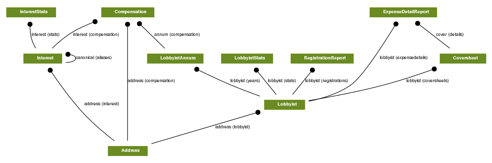

# tx_lobbying

[](https://travis-ci.org/texastribune/tx_lobbying)
Very early alpha

## About the data

The two main sources of data are:

1. The lists of registered lobbyists, by year:
   http://www.ethics.state.tx.us/dfs/loblists.htm

2. And the coversheets for the lobbyist activies reports (LA):
   http://www.ethics.state.tx.us/dfs/search_LOBBY.html

Names come from both sources of data, but only the coversheets have detailed
information about names.

The information for lobbying interests come from the registration forms. This
information is all entered by hand and will be very hard to use without
scrubbing. There should be a way to de-duplicate lobbying interests, and a way
to regenerate a lobbyist's interests based on the raw registration data stored.

The forms can, and are, amended often. When you do updates, it's a good idea
to go back a few years.


## Getting up and running

Set your environment variables. One way is to have a `.env` file with:

```
DJANGO_SETTINGS_MODULE=example_project.settings
DATABASE_URL=postgres:///tx_lobbying
HAYSTACK_URL=http://1270.0.01:9200/

# optional if you want to geocode
# https://geoservices.tamu.edu/Services/Geocode/WebService/
TAMU_API_KEY=5f4dcc3b5aa765d61d8327deb882cf99
```

and then using autoenv or `source .env` to activate it.

Install deps:

    pip install -r requirements.txt
    npm install

Get your database up and running with (Postgres instructions):

    createdb tx_lobbying  # if you have a simple Postgres setup
    phd createdb  # if you have a complicated DATABASE_URL, pip install postdoc

    # inital migration
    make resetdb

Then load data with:

    make scrape


## Running tests

Change `template1` to be postgis enabled:

    psql template1

    CREATE EXTENSION postgis;
    CREATE EXTENSION postgis_topology;

    make test

## Development

    pip install -r requirement-dev.txt

The project is configured to use sqlite by default, but if don't want to stab
yourself, set your DATABASE_URL to real database like Postgres.

Start the development server:

    python example_project/manage.py runserver


### How the data is modeled

Diagram:



Details:

Models that correspond directly to a piece of raw data are labelled with
**raw**.

* `Lobbyist`: the main model, represents a lobbyist
* `ExpenseDetailReport`: Not that useful yet. **raw**
* `Coversheet`: Expense coversheets. **raw**
* `LobbyistStats`: A summary of expenses for a year
* `RegistrationReport`: A lobbyist's registration for a year. **raw**
* `LobbyistAnnum`: Represent's a year of a lobbyist's existence in the database
* `Compensation`: How a lobbyist was compensated by their client. **raw**
* `Interest`: A lobbyist's clients, aka an interested party
* `InterestStats`: A summary of an interest's stats for a year
* `Address`: Any time we need to store an address

### The Future

Features not handled in this version but perhaps the next:

1. Handle corporate mergers/splits/renames
2. Link entities to campaign finance (state and federal)

### Additional Data Sources

In addition to the data from the TEC, these services are also used:

* Name de-duplication handled by [nomenklatura](http://opennames.org/).
* Geocoding handled by [TAMU Geoservices](http://geoservices.tamu.edu/Services/Geocode/)

